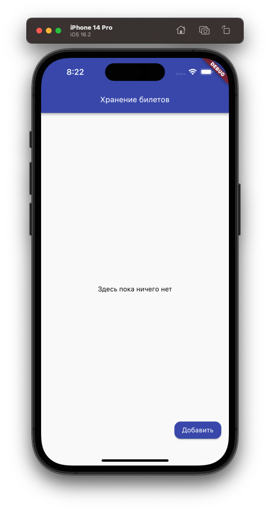
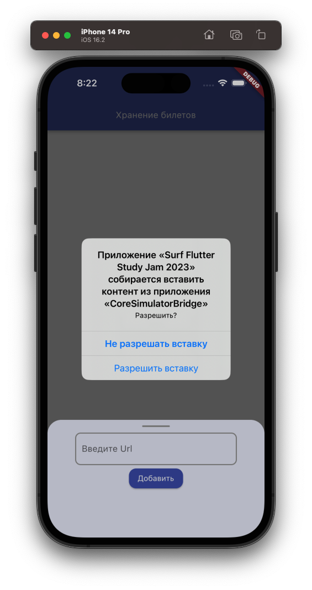
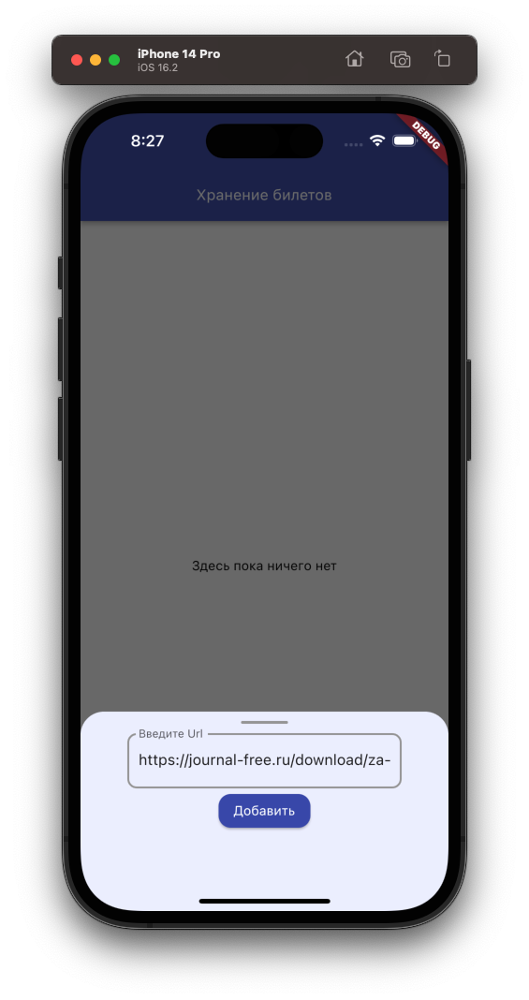
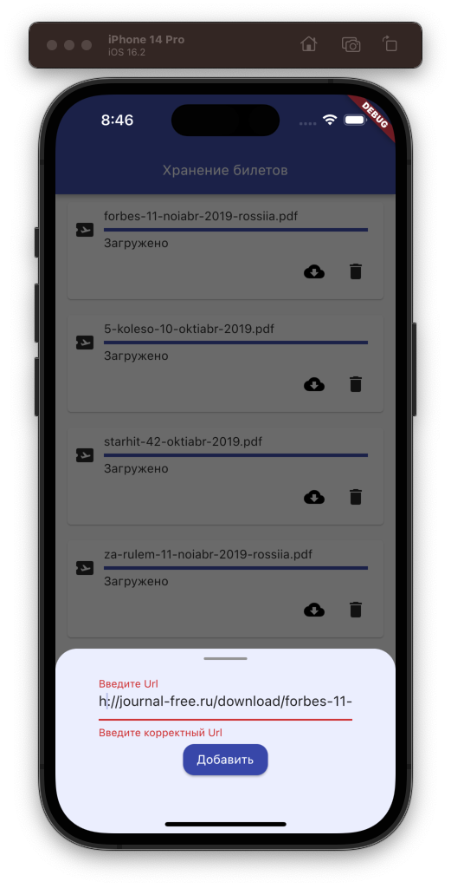
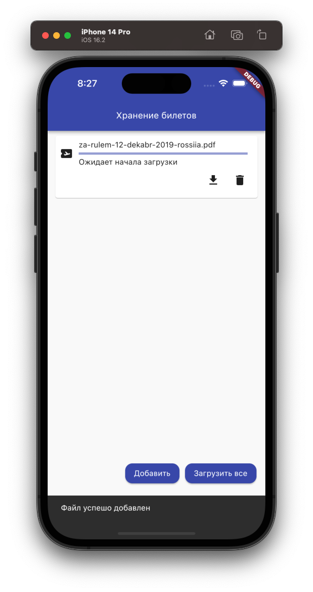
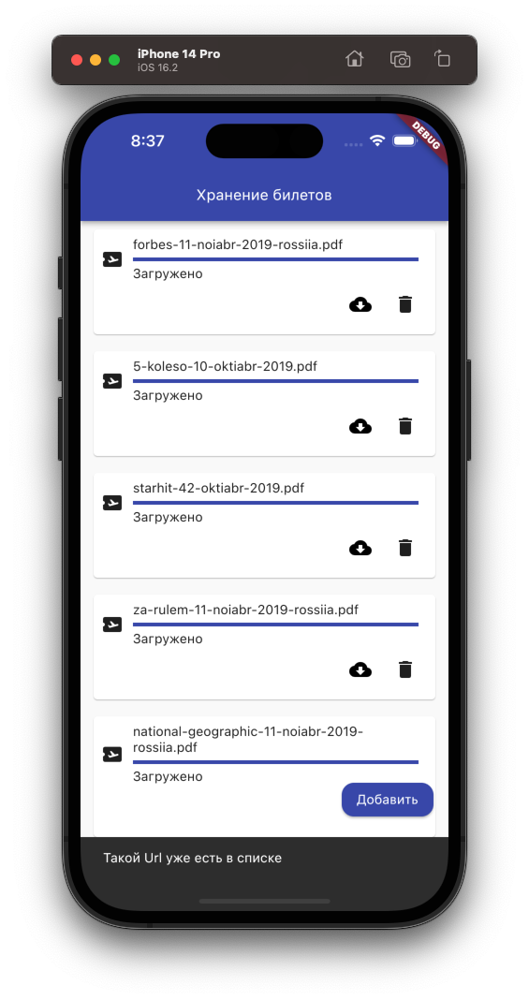
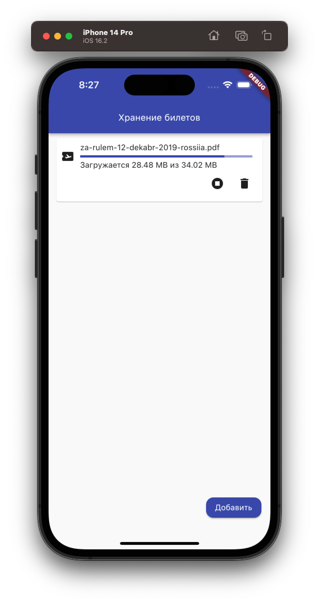
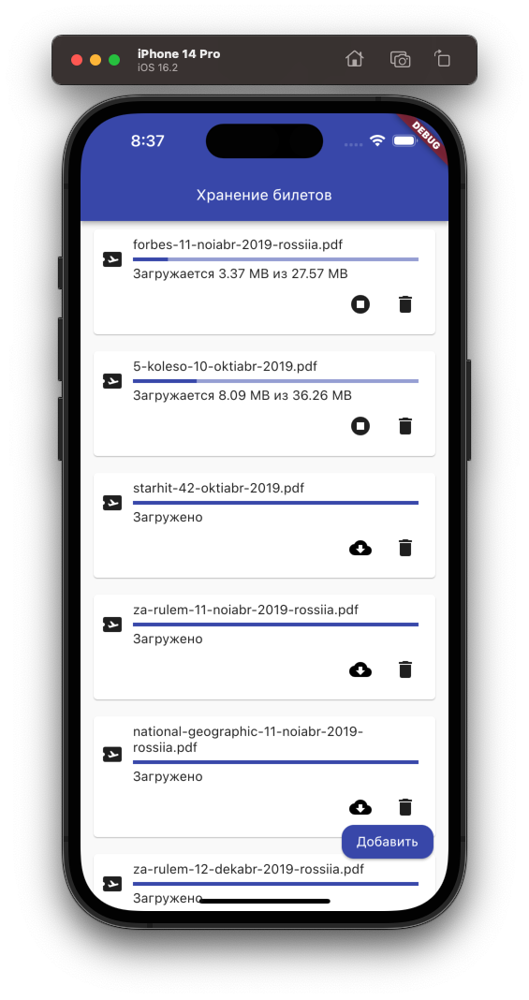
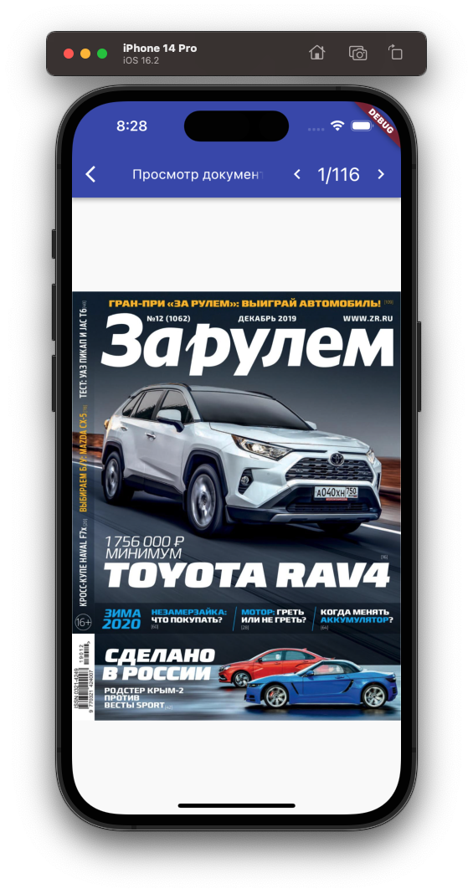
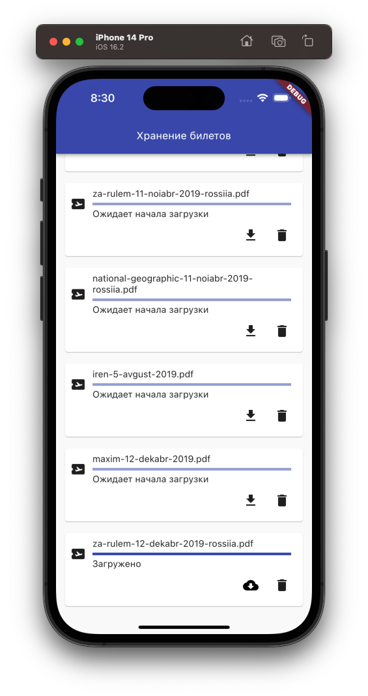

## Целевая платформа

Платформа: Android/Ios. 99% Android, последний процент времени успел только глянуть на Ios, вроде ничего не сломалось))

## Результаты

Сразу скажу, что всё успеть сделать не вышло, потому что-то выдающееся тут вряд ли можно будет найти) (но чтобы выдавать 10 часов на такую таску надо было её выдавать 1 апреля))

Задание 1 - выполнено;

Задание 2:
 - база - выполнено ✅;
 - автоматическая вставка из буфера ✅;
 - сохранение списка в локальной бд - есть (hive) ✅;

Задание 3:
 - скрытие кнопки добавление ссылки в конце спика - выполнено ✅;
 - сортировка по дате добавления - есть ✅, по состоянию загрузки нет ❌;

Задание 4:
 - загрузка и сохранение файлов - выполнено ✅ (файл хранится в папке прилаги, не стал морочиться с пермишенами, в hive хранятся пути к файлам по ключам);
 - загрузка всех незагруженных по одной кнопке - выполнено (но с багом ❌, грузятся по очереди, а не разом, не успел продебажить);
Задание 5:
 - просмотр pdf - выполнено ✅;

Креатив: я не ChatGpt, чтобы ещё успеть покреативничать, хотя очень хотелось)

## Ссылки на демонстрацию работы/скриншоты

# Пустой экран

# Модалка ввода Url(и Ui баги)

  
  
  

Клавиатура не закрывает модалку, забагалась клава и перестала открываться, придётся это проверить при запуске ;)

# Удачное и неудачное добавление билета

  
  

# Скачивание одиночное/массовое

  
  

# Просмотр документа

# Спрятанная строка плавающих кнопок в конце списка

Ну и всё, прошу расчехлять устройства для тестирования)
